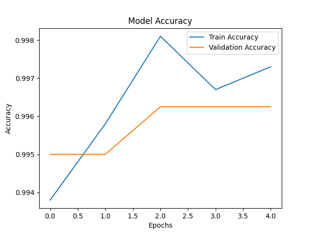
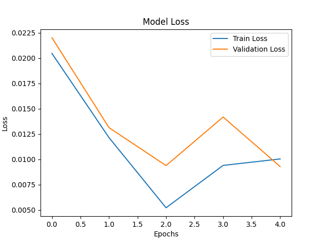

# Face Mask Detection System

This project is a real-time face mask detection system built using deep learning and computer vision techniques. It detects whether a person is wearing a mask or not using a live camera feed and displays the results through a web-based dashboard.

## Features

- Real-time face detection and mask classification  
- Supports multiple face detection in a single frame  
- Displays confidence score for each prediction  
- Captures and stores violation images (no mask detected)  
- Web-based dashboard for monitoring  
- Start/Stop camera control  

## Dataset

The model is trained on the Kaggle Face Mask Dataset (~12,000 images) consisting of two classes:
- With Mask  
- Without Mask  

Dataset link:  
https://www.kaggle.com/datasets/ashishjangra27/face-mask-12k-images-dataset  

## Model

- The system uses MobileNetV2 with transfer learning for efficient and accurate classification.  
- Model files are not included in this repository due to size limitations.  
- Download the trained model from: [model/README.md](model/README.md)  
- After downloading, place the model file inside the `model/` directory before running the application.  
- Refer to the notebook for details on model training.  

## Technology Stack

- Python  
- TensorFlow / Keras  
- OpenCV  
- Flask  

## Project Structure

```
face-mask-project/
│
├── app.py
├── requirements.txt
├── .gitignore
│
├── dataset/
│   └── README.md
│
├── model/
│   └── README.md
│
├── graphs/
│   ├── accuracy.png
│   └── loss.png
│
├── static/
├── templates/
├── violations/
│
├── demo_pics/

```


## Installation and Setup

1. Clone the repository:

```

git clone https://github.com/Roushan-77/Face-mask-detection.git
cd Face-mask-detection

```

2. Install dependencies:

```

pip install -r requirements.txt

```

3. Download the trained model and place it inside the `model/` folder.
> ensure to change the model name based on model you wish to use(code by deafult uses : mask_detector.h5):
- change here 'app.py'
```
model = load_model("model/<model_name>")
```

4. Run the application:

```

python app.py

```

5. Open your browser and go to:

```

[http://127.0.0.1:5000](http://127.0.0.1:5000)

```

## Usage

- Click "Start Camera" to begin detection
- Click "Stop Camera" to stop detection
- Use "Get Data" to view statistics
- Use "Show Violations" to view captured images
- Use "Delete Data" to clear stored violations

## Results

The model achieves high accuracy with stable performance. Training and validation graphs are available in the `graphs/` directory.
<p align="center">
  
  
</p>

## Notes

- The application uses the default system webcam for real-time detection
- Ensure no other application is using the camera before running
- Model file must be downloaded before execution

## Future Scope

- Multi-camera support
- Face tracking and counting
- Cloud deployment and remote monitoring